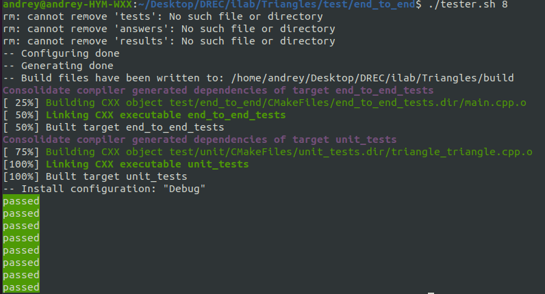

# Triangles
Hello everyone! Here you can find the program that determines whether triangles intersect in space or not. 

## Build
To copy this repository to yourself, enter:
```bash
git clone https://github.com/Waloid24/Triangles.git
```
Then go into "Triangles" directory:
```bash
cd Triangles
```
Next, we build the project:
```bash
cmake -B build -DCMAKE_BUILD_TYPE=Release
```
So, if the build folder has not been created, cmake will create it and use it as the root of the build directory.
Then type to build the project:
```bash
cmake --build build
```
You can find an example of program ready to run by going to the directory:
```bash
cd build/test/end_to_end
```
You can started it by entering:
```bash
./end_to_end_tests
```
At the input, the program waits for a sequence of numbers separated by spaces. The **first number** is **the number of triangles**, and **the subsequent ones** are **the coordinates of the vertices** of the triangles. For example:
```bash
2 3.118454 -5.889993 -1.330582 6.908256 3 10.275493 -0.186538 12.386439 4.371492 -13.020492 5.471334 8.013671 10.881959 2.221906 6.623814 -0.312856 -2.229983 8.797299
```
The program will return a number indicating the number of intersections. In this case, it will be 1.
Do not be afraid to enter the number of numbers corresponding to the coordinates of the vertices, not a multiple of 3 - nothing bad will happen. If you enter a letter, it will be replaced by a zero.

If you want to build a project, then from the repository folder (Triangles), go to the **test** folder:
```bash
cd test/
```
There are two types of tests: **end_to_end** and **unit**. If you are interested in running **end_to_end** testing, then go to the folder:
```bash
cd end_to_end/
```
Next, run the bash script *tester.sh* by passing it one argument: the number of tests you want to generate:
```bash
./tester.sh <num_tests>
```
For example:
```bash
./tester.sh 5
```
Then the project will be automatically built and tests will be called. You will see something like:

- **passed** - the test was successful;
- **failed** - the test was unsuccessful.

You may notice that you have created 3 folders: *answers*, *results*, *tests*.
- *tests* folder contains automatically generated input data on the basis of which the tests will work.
- *answers* folder contains the results for each test that the python script returned. We consider them correct.
- *results* folder contains the results for each test that our program returned.
Then we compare them and, based on the result of the comparison, we give an answer.

To delete these three folders quickly, type:
```bash
./deleter.sh
```
